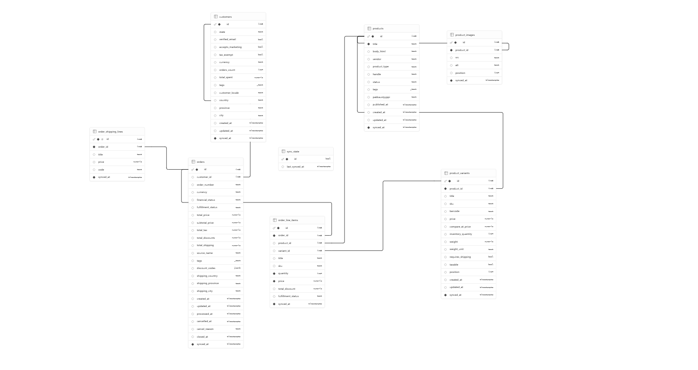

# Shopify to PostgreSQL
A project to exctract data from Shopify (Products, Customers, Orders) into a structured **PostgreSQL** database.

## Overview
This project connects to Shopify's Admin GraphQL API, pulls product, customer and order data, transforms it into a normalized relational schema and syncs it to database. Incremental syncing is implemented via Github Actions for routine pulls of only changed data with Slack alerts on failure.

## Architecture

```
Shopify Admin GraphQL API

        |
        v

data_source/            <- DemoDataSource or LiveShopifyDataSource, same interface

        |
        v

sync/transform.py       <- flattens raw Shopify JSON into rows matching the schema

        |
        v

sync/sync_all.py        <- upserts into Supabase via the supabase-py client

        |
        v

Supabase (PostgreSQL)   <- RLS-protected; only the service_role key can read/write
```

### Key Components
* **Source** -- Shopify Admin GraphQL API (`2026-07`). Note: by default `orders(...)` only returns orders from the last 60 days; pulling older history requires the `read_all_orders` scope (approved per-app by Shopify).

* **Data source layer** (`data_source/`) -- a `DhopifyDataSource` interface (`interface.py`) with two interchangeabale implementations: `DemoDataSource` reads pre-saved JSON from `demo_data/`, and `LiveShopifyDataSource` queries the real AP. Everything downstream only depend on the interface, so switching between them is a `MODE` environment variable, no code change needed.

* **Transform layer** (`sync/transform.py`) -- maps raw Shopify GraphQL nodes (nested, GraphQL-shaped) into flat dicts matching the Postgres tables.

* **Sync orchestration** (`sync/sync_all.py`) -- runs customer, then products (+variants + images), then orders (+ line items + shippinh lines), in that order so foreign keys resolve, and upserts each batch via `supabase-py`. On failure, prints a `SYNC_FAILURE_REASON:` line identifying the likely cause (expired token, missing secret, schema mismatch, etc.) before re-raising, which the GitHub Actions workflows use to build their Slack alert.

* **Database**: Supabase (PostgreSQL). Schema lives in `supabase/migrations/`. Tables: `customers`, `products`, `products_variants`, `product_images`, `orders`, `order_line_items`, `order_shipping_lines`, `order_line_item_tax_lines`, `order_shipping_line_tax_lines` plus a single-row `sync_state` table that stores the incremental-sync watermark.

`order_line_item_tax_lines` and `order_shipping_line_tax_lines` capture Shopify's actual per-line tax data (`LineItem.taxLines` / `ShippingLine.taxLines`) -- rate, rate as a percentage, amount, source, and channel liability -- separately from the order-level `orders.total_tax`. Shopify tracks tax independently per line item and per shipping line (so, for example, a reduced-rate food item, a standard-rate non-food item, and shipping can each carry a different rate on the same order); this is what lets that be queried directly instead of only ever seeing one blended order total.

## How to run it
```bash
python -m sync.sync_all                 #demo data (MODE unset or 'demo')
MODE=live python -m sync.sync_all       # live Shopify API, incremental after the first run
MODE=live FULL_SYNC=true python -m sync.sync_all # force a full resync
```

## Database Schema Diagram



## Demo Data

There are two different demo datasets in this project: the `seed.sql` file in the `\supabase` folder, and the JSON files in the `\demo_data` folder.

These demos should **NOT** be run on the same database as it will fail on duplicate primary keys. 

### SQL Seed

`/seed.sql` file where there is SQL `create` scripts to add demo data to the database. Can be copy-pasted straight to Supabase SQL Editor.

### Sync Demo

Three folders for simulating (or running) a real sync:
1. `/demo_data` for demo data formatted in JSON.
2. `/data_source` for reading the Shopify JSON.
3. `/sync` for transforming the raw JSON into a dictionary matching the database tables.

## Authentication (`MODE=live` only)

`LiveShopifyDataSource` supports two interchangeale ways to authenticate with Shopify, picked automatically based on what's set in the `.env` file.

1. **`SHOPIFY_ACCESS_TOKEN`** : a static pre-generated token. The quickest way to check if the token is still valid is `python -m scripts.customer_count`, a script that returns the number of customers in Shopify using the token.
2. **`SHOPIFY CLIENT_ID` + `SHOPIFY_CLIENT_SECRET`** : A Dev Dashboard app's credentials. Only works when the app and store are in the same organization. Token expires within 24h.

### Incremental syncing

After the first succesfull `MODE=live` run, the run's start time is recorded in the `sync_state` table. Every subsequent run asks Shopify for only records with `updated_at` value after that timestamp, instead of re-pulling the entire store.

**Known limitation**: this only catches created and changed records. A record *deleted* i Shopify never shows up as "updated", so incremental runs alone never remove a row that was deleted upstream. SEt `FULL_SYNC=true` for an occasional full resync to reconcile that drift -> the scheduled `shopify-full-resync.yml` workflow does this automatically once a month.

## Privacy

Customers are kept **pseydonymous**: Shopify's numeric customer ID is kept as a join key so orders can be linked to the same customer.

Excluded on purpose: first/last name, email, phone, street address and postal code, IP address, browser/device data, payment method details and free-text notes. Geography is kept at country/province/city level only.

See the column comments on `...shopify_schema.sql` for the full field-by-field rationale.

## Security

### Current setup
- RLS enabled on all tables (see `supabase/migrations/..._rls_security.sql`, `..._shopify_schema.sql` and `..._sync_state.sql`)
- `anon` and `authenticated` (Supabase's default client roles) have no access —
  this project has no public-facing client app or signed-in end users
- `service_role` key (used only by the sync script, locally and in the Github Actions) bypasses RLS by default —
  treat it like a password, never commit it, never use it client-side